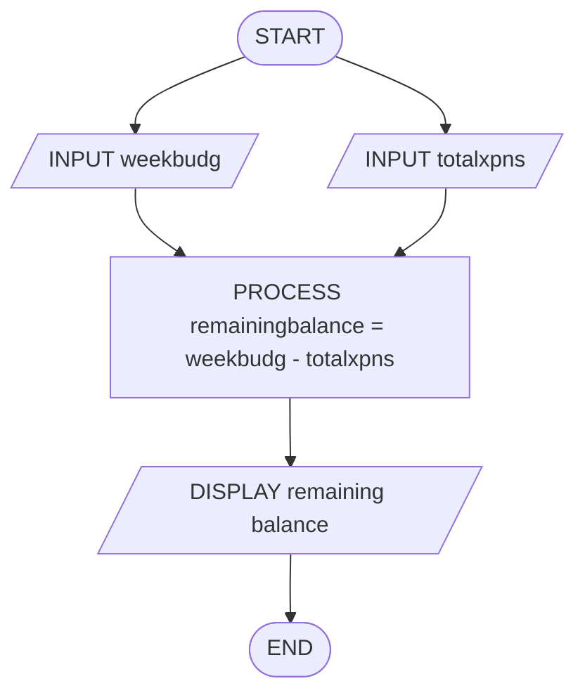

```mermaid
flowchart TD
    A([START]) --> B[/INPUT weekbudg/]
    A --> C[/INPUT totalxpns/]
    B --> D[PROCESS remainingbalance = weekbudg - totalxpns]
    C --> D
    D --> E[/DISPLAY remaining balance/]
    E --> F([END])
```