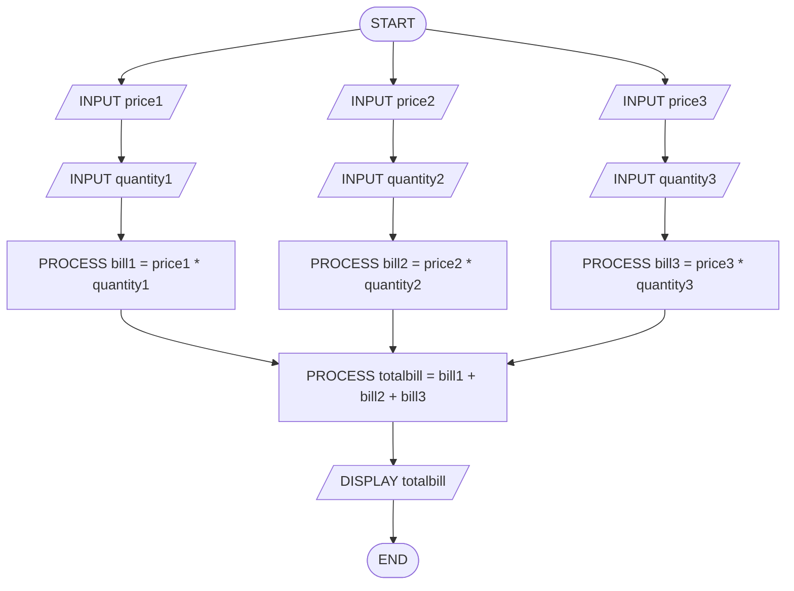

```mermaid
flowchart TD
    A([START]) --> B[/INPUT price1/]
    B --> C[/INPUT quantity1/]
    C --> D[PROCESS bill1 = price1 * quantity1]
    A --> E[/INPUT price2/]
    E --> F[/INPUT quantity2/]
    F --> G[PROCESS bill2 = price2 * quantity2]
    A --> H[/INPUT price3/]
    H --> I[/INPUT quantity3/]
    I --> J[PROCESS bill3 = price3 * quantity3]
    D --> K[PROCESS totalbill = bill1 + bill2 + bill3]
    G --> K
    J --> K
    K --> L[/DISPLAY totalbill/]
    L --> M([END])
```