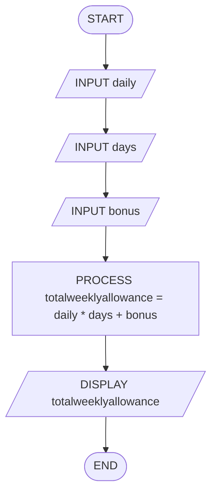

```mermaid
flowchart TD
    A([START]) --> B[/INPUT daily/]
    B --> C[/INPUT days/]
    C --> D[/INPUT bonus/]
    D --> E[PROCESS totalweeklyallowance = daily * days + bonus]
    E --> F[/DISPLAY totalweeklyallowance/]
    F --> G([END])
```