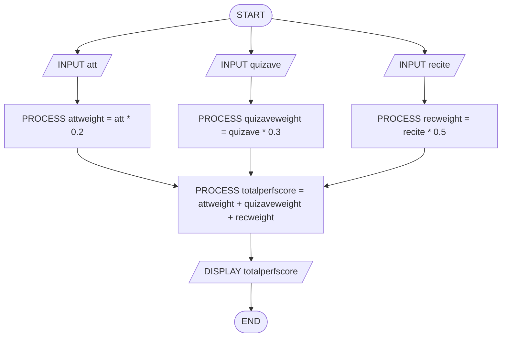

```mermaid
flowchart TD
    A([START]) --> B[/INPUT att/]
    B --> C[PROCESS attweight = att * 0.2]
    A --> D[/INPUT quizave/]
    D --> E[PROCESS quizaveweight = quizave * 0.3]
    A --> F[/INPUT recite/]
    F --> G[PROCESS recweight = recite * 0.5]
    C --> H[PROCESS totalperfscore = attweight + quizaveweight + recweight]
    E --> H
    G --> H
    H --> I[/DISPLAY totalperfscore/]
    I --> J([END])
```