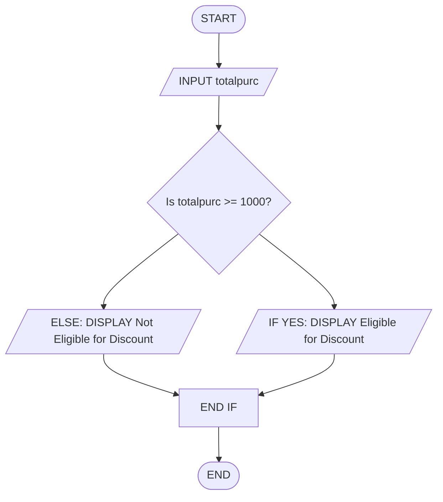

```mermaid
flowchart TD
    A([START]) --> B[/INPUT totalpurc/]
    B --> C{Is totalpurc >= 1000?}
    C --> D[/IF YES: DISPLAY Eligible for Discount/]
    C --> E[/ELSE: DISPLAY Not Eligible for Discount/]
    E --> F[END IF]
    D --> F
    F --> G([END])
```