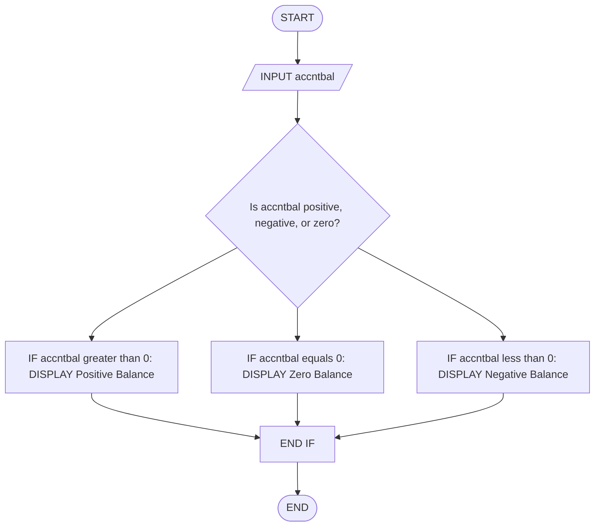

```mermaid
flowchart TD
    A([START]) --> B[/INPUT accntbal/]
    B --> C{Is accntbal positive, negative, or zero?}
    C --> D[IF accntbal greater than 0: DISPLAY Positive Balance]
    C --> E[IF accntbal equals 0: DISPLAY Zero Balance]
    C --> F[IF accntbal less than 0: DISPLAY Negative Balance]
    D --> G[END IF]
    E --> G
    F --> G
    G --> H([END])
```