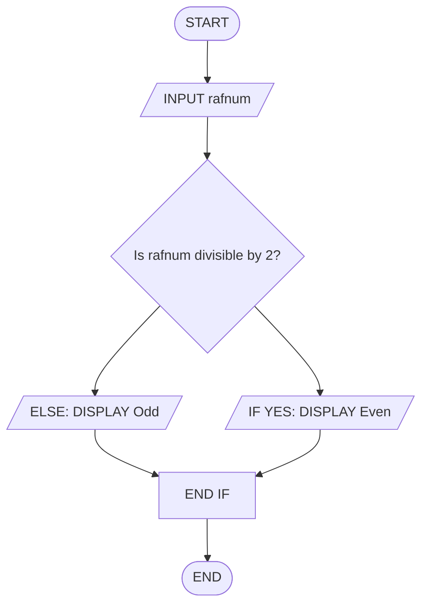

```mermaid
flowchart TD
    A([START]) --> B[/INPUT rafnum/]
    B --> C{Is rafnum divisible by 2?}
    C --> D[/IF YES: DISPLAY Even/]
    C --> E[/ELSE: DISPLAY Odd/]
    E --> F[END IF]
    D --> F
    F --> G([END])
```